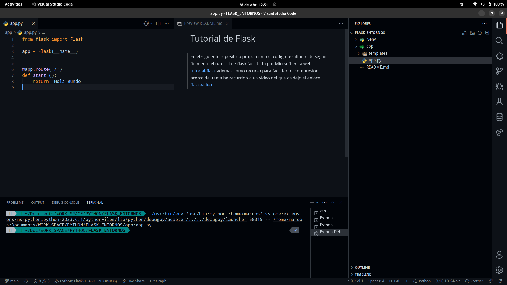
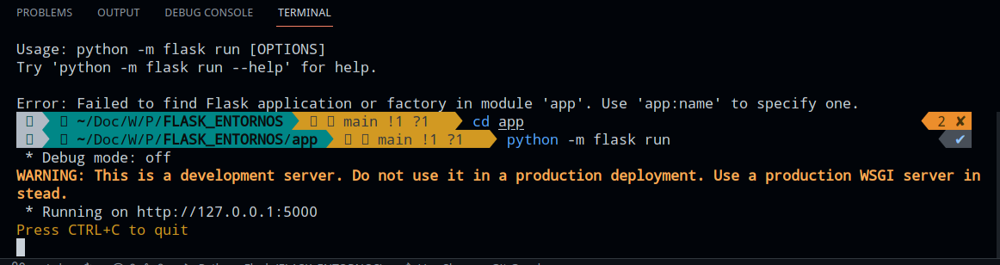
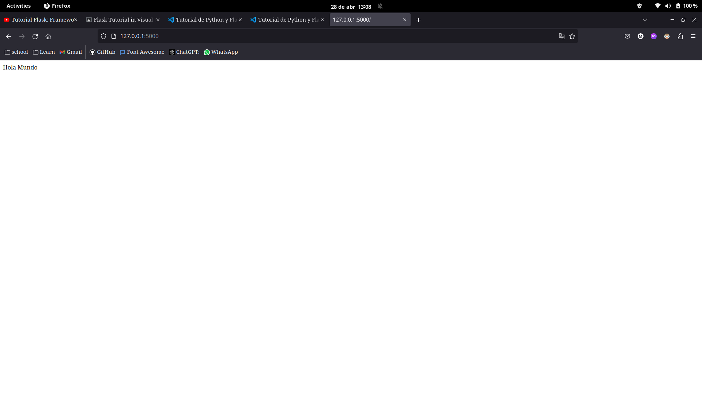
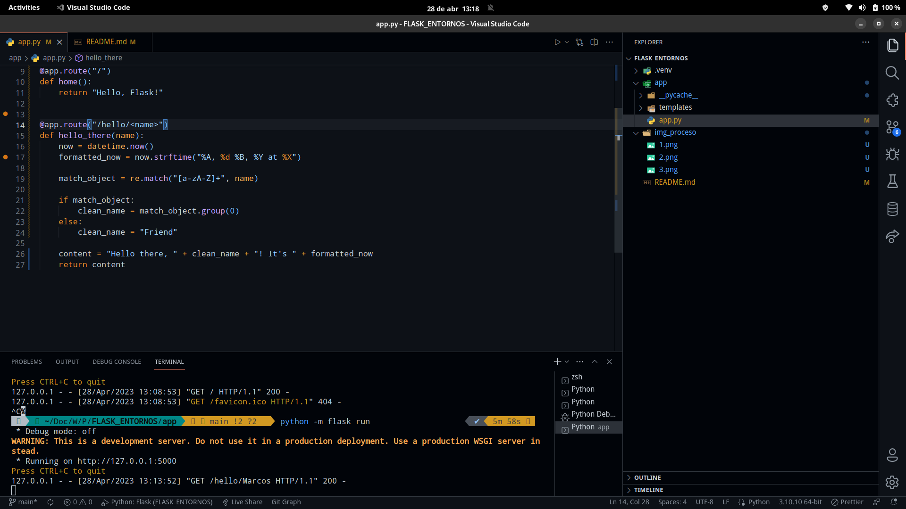
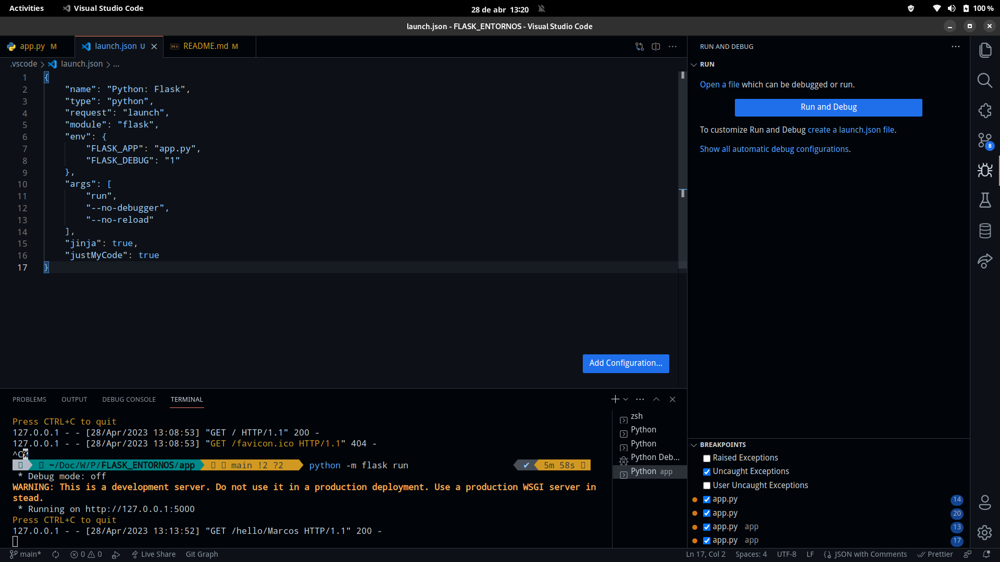
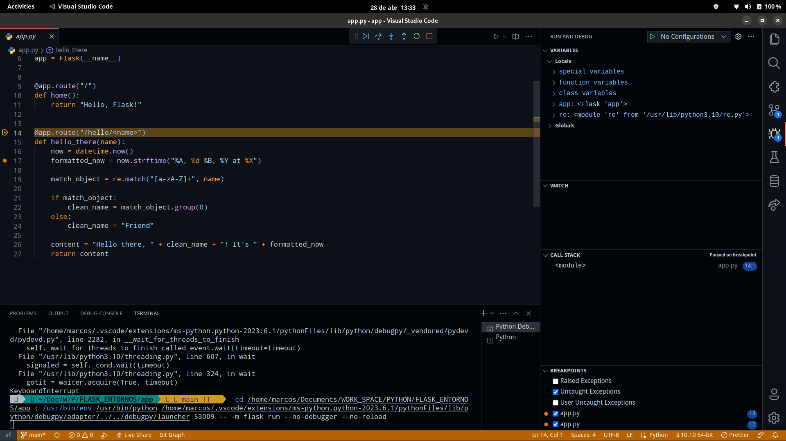
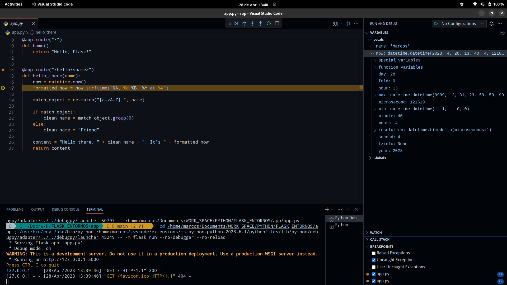
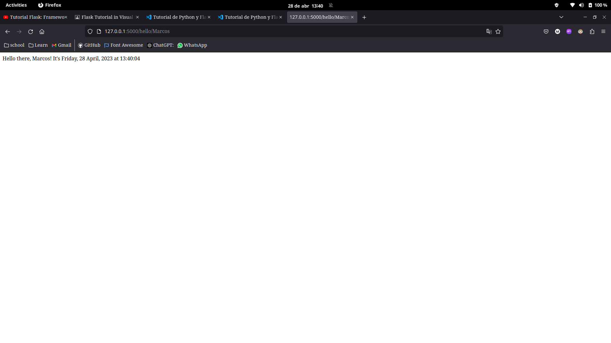
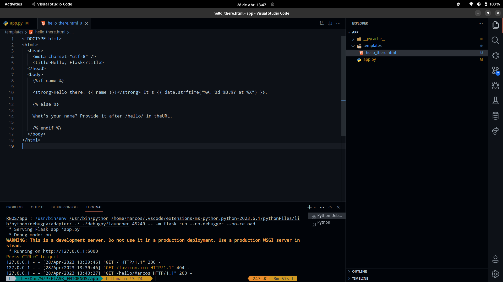

# Tutorial de Flask
En el siguiente repositirio proporciono el codigo resultante de seguir fielmente el tutorial de flask facilitado  por Micrsoft en la web [tutorial-flask](https://code.visualstudio.com/docs/python/tutorial-flask) ademas como recurso para facilitar mi compresion acerca del tema he recurrido a un video del que os dejo el enlace [flask-video](https://www.youtube.com/watch?v=-1DmVCPB6H8)


### Prepar entorno de trabajo:
#### Pasos:
1. Debemos crear un entorno , para ello debemos emplear env o conda. En este caso hemos empleado env.
2. Debemos instalar los recursos necesarios para poder realizar el tutorial, pero el mas importante sera Flask .
3. Debemos creaar una carpeta llamada app , sitio donde colocaremos nuestra app.
4. Dentro de esta carpeta crearemos un archivo de igual nombre que el directorio.
5. Tambien debemos crear un directorio cuyo nombre sera ```templates``` donde el motor generador de plantillas ```Jinja2``` podra encontrar las plantillas web cuya extension sea .html empleadas en nuestro proyecto.

### Asi deberia quedar inicialmente estructurado :




# Parte 1: Debug y nuestro 'Hola Mundo'

```python
from flask import Flask

app = Flask(__name__)


@app.route('/')
def start ():
    return 'Hola Mundo'

```

Comenzamos importanto la clase Flask y la instanciamos en la variable app.

Luego empleando el decorador ```@app.route('/')``` indicamos que esta sera nuestra ruta raiz y seguido creamos la vista que se ejecutara inicialmente.

Es de suma importancia saber que todas las vistas serar declaradas como una funcion en python y deben tener un retorno,en este caso nuestro  hola mundo.

```
Para poder correr nuestra app, podemos emplear dos formas :
1. python -m flask run
2. La segunda opcion la veremos a continuacion
```





Podemos observar que ya tenemos nuestro hola mundo.

### Rutas personalizadas 

Con rutas personalizadas nos estamos refiriendo a que podemos modificar nuestras url,por ejemplo:

```python

@app.route("/hello/<name>")
def hello_there(name):
    now = datetime.now()
    formatted_now = now.strftime("%A, %d %B, %Y at %X")

    match_object = re.match("[a-zA-Z]+", name)

    if match_object:
        clean_name = match_object.group(0)
    else:
        clean_name = "Friend"

    content = "Hello there, " + clean_name + "! It's " + formatted_now
    return content
```
Si ahora en nuestro navegador escribimos ``` http://127.0.0.1:5000/hello/Marcos```

Tendremos como resultado lo siguiente :
```
Hello there, Marcos! It's Friday, 28 April, 2023 at 13:13:52
```

Por tanto de esas forma podemos ver como podemo recibir variables via url.

En el momento que definimos nuestra ruta personalizada debemos tener en cuenta ```@app.route("/hello/<name>")``` que las variables que recibira la vista deben ir entre simbolos de mayor y menor que .

### Debug 

Colocamos dos breakpoints de la siguiente forma:



Luego creamos el archivo de configuracion json



Luego presionamos  la combinacion de teclas ctrl + f5 para entrar en modo debug de la siguiente forma 



De esta  forma podemos debuguear nuestro codigo como si fuera un simple archivo python





# Templates y Jinja2
Dentro de nuestra carpeta app al inicio habiamos creado una carpeta con el nombre templates , aqui crearemos un archivo html con el nombre hello_there con el codigo siguiente:

```html

<!DOCTYPE html>
<html>
    <head>
        <meta charset="utf-8" />
        <title>Hello, Flask</title>
    </head>
    <body>
        
            <strong>Hello there, {{ name }}!</strong> It's {{ date.strftime("%A, %d %B, %Y at %X") }}.
        
            What's your name? Provide it after /hello/ in the URL.
        
    </body>
</html>


```

En esta pantilla podemos ver que hay cosas que nunca habiamos empleado en un html comun , como es el caso de los modificadores de posicion y control de flujo, los modificadores de posicion se indican mediante el uso de {{variable }} y dentro van las variables y para realizar un procedimiento haciendo uso del lenguaje de programacion de python emplearemos 


Para poder mostrar como salida por el navegador nuestro archivo html con las varibles integradas podemos hacer uso de render_templates , funcionalidad que debemos previamente importar de flask .


```python

@app.route("/hello/")
@app.route("/hello/<name>")
def hello_there(name = None):
    return render_template(
        "hello_there.html",
        name=name,
        date=datetime.now()
    )
```

En el codigo anterior lo que hacemos es recibir un parametro atraves de la url y haciendo uso de render templates , debemos pasar como primer parametro el nombre de nuestro html que como norma general tiene el nombre de la funcion a la que pertenece, seguido de las variables que deberan ser sustituidas donde hemos colocado los modificadores de posicion.




Podriamos llamar a nuestra funcion con parametro o sin ningun parametro

### Sin parametros : 


### Con el parametro : 


# Archivos estaticos como css y js. Carpeta static:


