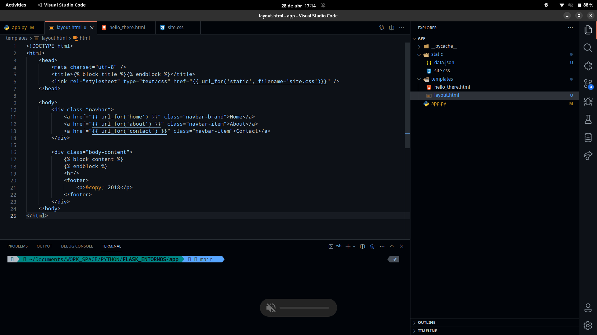
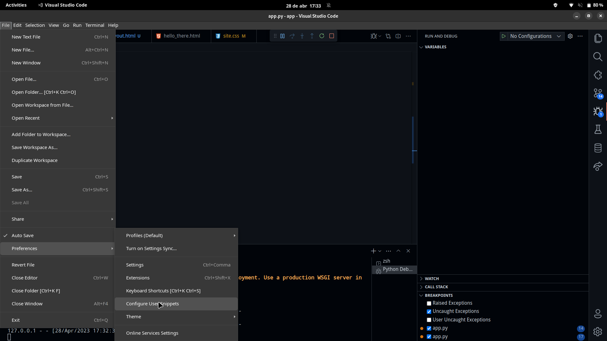

# Tutorial de Flask
En el siguiente repositirio proporciono el codigo resultante de seguir fielmente el tutorial de flask facilitado  por Micrsoft en la web [tutorial-flask](https://code.visualstudio.com/docs/python/tutorial-flask) ademas como recurso para facilitar mi compresion acerca del tema he recurrido a un video del que os dejo el enlace [flask-video](https://www.youtube.com/watch?v=-1DmVCPB6H8)


### Preparar entorno de trabajo:
#### Pasos:
1. Debemos crear un entorno , para ello debemos emplear env o conda. En este caso hemos empleado env.
2. Debemos instalar los recursos necesarios para poder realizar el tutorial, pero el más importante será Flask .
3. Debemos crear una carpeta llamada app , sitio donde colocaremos nuestra app.
4. Dentro de esta carpeta crearemos un archivo de igual nombre que el directorio.
5. También debemos crear un directorio cuyo nombre será ```templates``` donde el motor generador de plantillas ```Jinja2``` podrá encontrar las plantillas web cuya extensión sea .html empleadas en nuestro proyecto.

### Asi deberia quedar inicialmente estructurado :


# Parte 1: Debug y nuestro 'Hola Mundo'

```python
from flask import Flask

app = Flask(__name__)


@app.route('/')
def start ():
   return 'Hola Mundo'

```

Comenzamos importando la clase Flask y la instalamos en la variable app.

Luego empleando el decorador ```@app.route('/')``` indicamos que esta será nuestra ruta raíz y seguido creamos la vista que se ejecutará inicialmente.

Es de suma importancia saber que todas las vistas serán declaradas como una función en python y deben tener un retorno,en este caso nuestro  hola mundo.

```
Para poder correr nuestra app, podemos emplear dos formas :
1. python -m flask run
2. La segunda opción la veremos a continuación
```


Podemos observar que ya tenemos nuestro hola mundo.

### Rutas personalizadas

Con rutas personalizadas nos estamos refiriendo a que podemos modificar nuestras url,por ejemplo:

```python

@app.route("/hello/<name>")
def hello_there(name):
   now = datetime.now()
   formatted_now = now.strftime("%A, %d %B, %Y at %X")

   match_object = re.match("[a-zA-Z]+", name)

   if match_object:
       clean_name = match_object.group(0)
   else:
       clean_name = "Friend"

   content = "Hello there, " + clean_name + "! It's " + formatted_now
   return content
```
Si ahora en nuestro navegador escribimos ``` http://127.0.0.1:5000/hello/Marcos```

Tendremos como resultado lo siguiente :
```
Hello there, Marcos! It's Friday, 28 April, 2023 at 13:13:52
```

Por tanto de esta forma podemos ver cómo puedes recibir variables via url.

En el momento que definimos nuestra ruta personalizada debemos tener en cuenta ```@app.route("/hello/<name>")``` que las variables que recibirá la vista deben ir entre símbolos de mayor y menor que .

### Debug

Colocamos dos breakpoints de la siguiente forma:


Luego creamos el archivo de configuración json


Luego presionamos  la combinación de teclas ctrl + f5 para entrar en modo debug de la siguiente forma


De esta  forma podemos debuguear nuestro código como si fuera un simple archivo python


# Templates y Jinja2
Dentro de nuestra carpeta app al inicio habíamos creado una carpeta con el nombre templates , aquí crearemos un archivo html con el nombre hello there con el código siguiente:

```html

<!DOCTYPE html>
<html>
   <head>
       <meta charset="utf-8" />
       <title>Hello, Flask</title>
   </head>
   <body>
       
           <strong>Hello there, {{ name }}!</strong> It's {{ date.strftime("%A, %d %B, %Y at %X") }}.
       
           What's your name? Provide it after /hello/ in the URL.
       
   </body>
</html>


```

En esta pantalla podemos ver que hay cosas que nunca habíamos empleado en un html común , como es el caso de los modificadores de posición y control de flujo, los modificadores de posición se indican mediante el uso de {{variable }} y dentro van las variables y para realizar un procedimiento haciendo uso del lenguaje de programación de python emplearemos 


Para poder mostrar como salida por el navegador nuestro archivo html con las variables integradas podemos hacer uso de render templates , funcionalidad que debemos previamente importar de flask .


```python

@app.route("/hello/")
@app.route("/hello/<name>")
def hello_there(name = None):
   return render_template(
       "hello_there.html",
       name=name,
       date=datetime.now()
   )
```

En el código anterior lo que hacemos es recibir un parámetro a través de la url y haciendo uso de render templates , debemos pasar como primer parámetro el nombre de nuestro html que como norma general tiene el nombre de la función a la que pertenece, seguido de las variables que deberán ser sustituidas donde hemos colocado los modificadores de posición.


Podríamos llamar a nuestra función con parámetro o sin ningún parámetro

### Sin parametros :


### Con el parametro :


# Archivos estáticos como css y js. Carpeta static:

Dentro de la carpeta app creamos otra carpeta que por buena práctica debe llamarse ```static``` aquí almacenaremos archivos como css, js , etc.

Dentro de nuestro archivo  css estableceremos el estilo que creamos  conveniente, también modificaremos nuestro archivo html y nos creamos otro archivo html llamado layout que es donde estableceremos un  formato que luego gracias a flask podemos heredar en nuestras siguientes plantillas.

### Realizando comprobaciones ...




### Generando snippet para la fácil creación de nuevas plantillas




## Luego nos creamos tres html más para poder generar un menú horizontal:

### Quedara asi:


### Por último modificamos la vista home y agregamos dos más:

```python
   # Replace the existing home function with the one below
   @app.route("/")
   def home():
       return render_template("home.html")

   # New functions
   @app.route("/about/")
   def about():
       return render_template("about.html")

   @app.route("/contact/")
   def contact():
       return render_template("contact.html")

```

# Ejecutamos la información :


